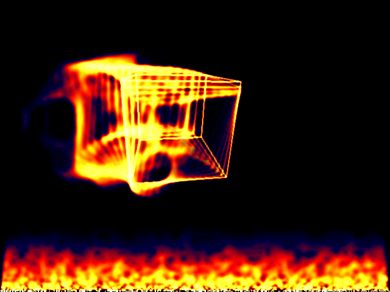

# *FireCube & Flames*

## **Screenshot**

## **Palette**

The palette is composed of 256 colors organized as follows:
- 32 colors from black to blue
- 32 colors from blue to red
- 32 colors from red to yellow
- 160 colors from yellow to white

It is arranged so that it fades to black at the bottom and goes to white at the maximum

## **Algorithm**

The flame buffer is just a big array the size of the screen.  
On each frame, the buffer is traversed and each pixels is averaged with adjacent ones.  
Then an attenuation is performed so that the fire fades out on the higher rows.  
The resulting value, is then stored on the row above to make the fire moves up.

The bottom two rows are then filled with randomly white pixels to fuel again the fire effect.

To keep it simple, the averge is done on a number of pixels that is a power of two.

## **FireCube**

To make the 3D cube in fire, you just do the rendering inside the flame buffer.  
However to make a flame trail, we redraw the cube only one every 3 frames.  

The cube is drawn using the [Bresenham](https://en.wikipedia.org/wiki/Bresenham%27s_line_algorithm) 
algorithm which is very efficient for this purpose.

## **License**

All the code are under the **Apache License 2.0**.  
A copy of the license is available [here](https://choosealicense.com/licenses/apache-2.0/).