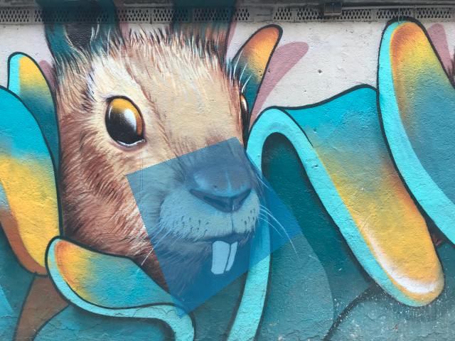

# *A Glass of Picture*

## **Screenshot**

## **Algorithm**

A 3D plane is rotated in front of a picture and appears to be transparent.  
To make it so, we interpolate a new value between each RGBA component from the background image and the color of the plane.  
The "t" value for the plane is set to 50%.

## **License**

All the code are under the **Apache License 2.0**.  
A copy of the license is available [here](https://choosealicense.com/licenses/apache-2.0/).
