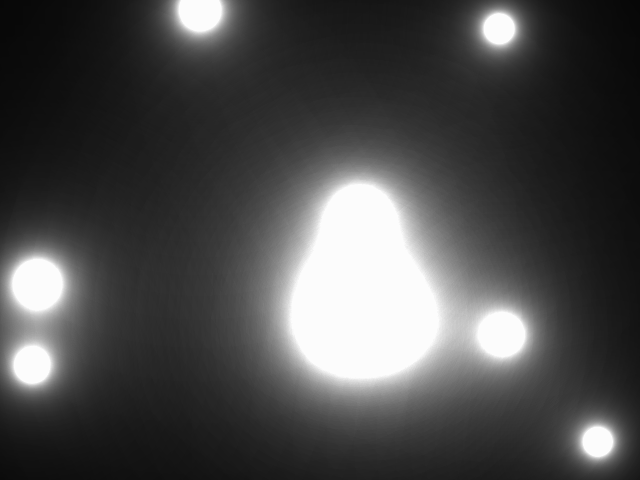

# *Light Balls*


## **Screenshot**



## **Palette**

For this effect we use a standard 256 colors grayscale palette.  
However to smooth things up, the value is passed through an ease function:

``` javascript
function ease(x) {
  return x * x * x;
}
```

The function is charge of creating the palette clamps the value between [0..1] before
calling the ease function

``` javascript
function createPalette() {
  for (var i = 0; i < 256; i++) {
    var v = Math.floor(255 * ease(i / 256.0));
    palette[i] = 'rgb(v, v, v)';
  }
}
```

## **Algorithm**

For each pixels on the screen, we need to compute the distance between this pixel and the 
light balls.  
From there a ratio is computed that depends on the balls and its distance.  
All the ratio are added together and the result is a direct index in the color palette that is
displayed on the screen.


## **License**

All the code are under the **Apache License 2.0**.  
A copy of the license is available [here](https://choosealicense.com/licenses/apache-2.0/).
