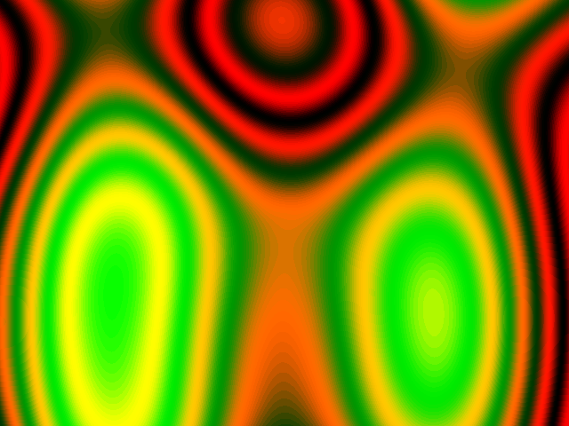

# *Colorful Plasma*


## **Screenshot**



## **Palette**

For this effect the palette of 256 colors is build around 2 sine functions.  
Only the Red and Green components are used.

``` javascript
function createPalette() {
  for (var i = 0; i < 256; i++) {
      var r = Math.floor(128 + 128 * Math.sin(Math.PI * i / 16.0));
      var g = Math.floor(128 + 128 * Math.sin(Math.PI * i / 128.0));
      var b = 0;
  }
}
```

This gives a glowing green-ish colors to the plasma.


## **Algorithm**

A plasma is basically an intersection between multiple sine and cosine functions.  
The more you add, the more complex the output will be.  
To make the plasma moves, you can add a time component that will modify the sine functions.  
So for each pixels on the screen, you compute multiple functions that will give you a final value.

At the very end, you need to ensure that your value is between [-1, 1] so it can be mapped  
back to [0, 255] to retrieve the corresponding color in the palette.

## **License**

All the code are under the **Apache License 2.0**.  
A copy of the license is available [here](https://choosealicense.com/licenses/apache-2.0/).
