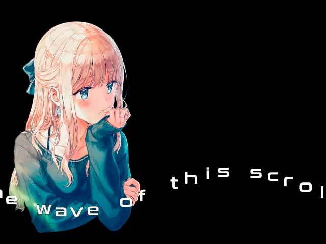
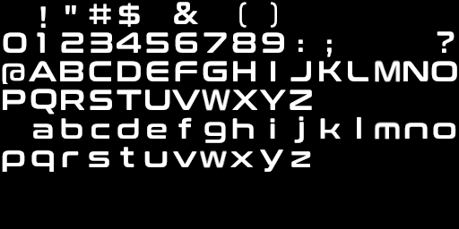

# *Can you read it?*


## **Screenshot**




## **Font Map**

All the characters from the font have the same width and height (32x32 here).  
They are ordered according to their ASCII value (starting from space / 32d / 0x20) so that it is easy to 
find them programmaticaly in the map.  

``` typescript
// i is the current char in the string
let value = string.charCodeAt(i);

// the index starts at 0
let index = value - 32;

// x position of the character in the font map. 
// Character are 32 px wide
// There are 16 characters per line
let x = (index % 16) * 32;

// y position of the character in the font map.
// Character are 32px height so we divide index by 32 (>> 4) to have the correct line
// from the ASCII code.
let y = (index >> 4) * 32;
```

Characters that are not representated are left blank.



## **Algorithm**

The text is drawn on a surface which is wider than the actual display screen.  
This way, no extra code is necessary to compute the clipping of a character on the left or right border.  
Only a portion of the surface is shown on the display screen.  

The initial position on the text is on the far right side (so hidden from the user).  
For every frame, the X position is decreased and one character is added to the list of characters drawn in the surface. When the X position is at the left side, we remove one character from the string until we reach the end of the string.  
At this moment, all the characters have been displayed and we can loop back at the beginning.

The sine wave for the scroller is computed from the current X position of the character.  
The formula is quite simple:

``` typescript
let Y_pos = CenterY + Amplitude * sin(2 * PI * Frequency * X_pos / DisplayWidth)
```
- *CenterY* is the middle of the font surface
- *Amplitude* is how much the scroller will move up or down from the center line (CenterY)
- *Frequency* is the number of waves displayed on the screen
- *X_pos* is the current position for this character
- *DisplayWidth* is the width of the display 


## **License**

All the code are under the **Apache License 2.0**.  
A copy of the license is available [here](https://choosealicense.com/licenses/apache-2.0/).
