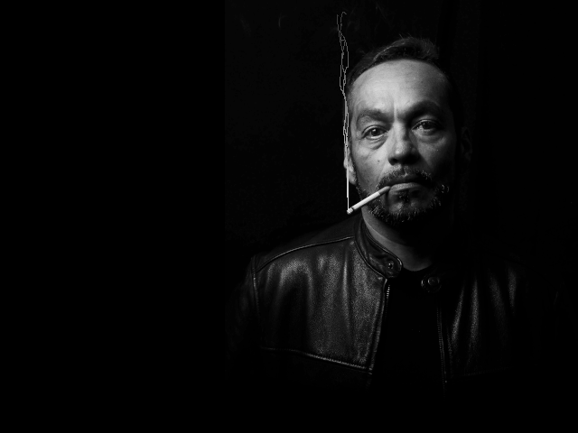

# *Death Smoking*

## **Screenshot**

## **Algorithm**

The smoke is created from 1 fixed point located in the cigarette end, and 3 points that move independently.
The trail is make with a Linear Interpolation between the fixed point and one other point.  
The parameter *t* in the lerp is compute with different delay to create the "smoke" effect.

## **License**

All the code are under the **Apache License 2.0**.  
A copy of the license is available [here](https://choosealicense.com/licenses/apache-2.0/).
