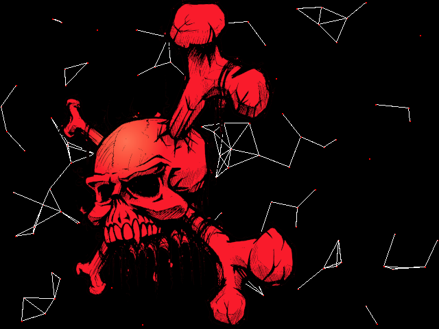

# *A Skull ahead*

## **Screenshot**

## **Algorithm**

No fancy algorithm here. A set of random particules moving around the screen.  
When the distance between two points is below 50 pixels, we link those particules with a line.  
On top of that, we are adding a moving sprite with transparent portion.

## **License**

All the code are under the **Apache License 2.0**.  
A copy of the license is available [here](https://choosealicense.com/licenses/apache-2.0/).
