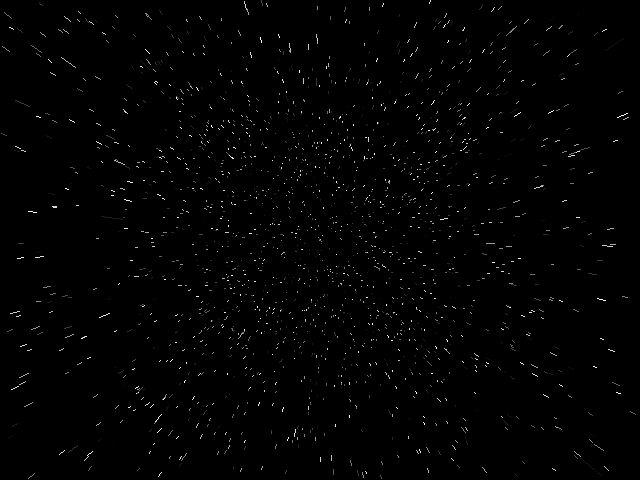

# *In the stars*


## **Screenshot**



## **Algorithm**

The color palette for this effect is a simple grayscale palette.

For every stars (we have 2,048 here), you randomly select an X, Y and Z value as well as a color.  
You also need to select a speed for each of them so they will move towards the observer at different speed.  

Then for every frame you need to do the following:
- update the z value with the speed
- do the 3D to 2D projection
- render the stars

The 3D to 2D projection is done with:

``` javascript
// center of the screen
const cx = DISPLAY_WIDTH  >> 1;
const cy = DISPLAY_HEIGHT >> 1;

// projection
let x = cx + Math.floor((star.x * ZOOM) / (star.z + DEPTH));
let y = cy + Math.floor((star.y * ZOOM) / (star.z + DEPTH));
```

If either the X or Y of the 2D projection is out of the canvas, you discard the drawing and generate a new star.  
This way, you will always have 2,048 stars on the screen.

To improve the sensation of speed, you can record the previous Z value of the star before updating it with the speed. Then, instead of drawing just a point on the screen, you can draw a line between the previous position and the new position. 

## **License**

All the code are under the **Apache License 2.0**.  
A copy of the license is available [here](https://choosealicense.com/licenses/apache-2.0/).
