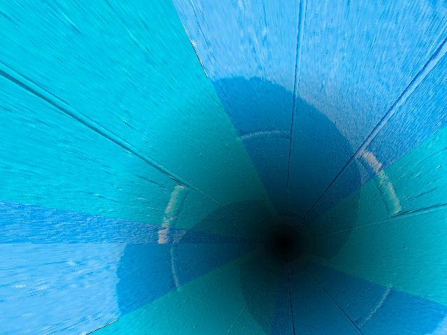

# *Endless Tunnel*

## **Screenshot**

## **Algorithm**

We need at least two arrays:

- distance: contains the distance from each pixels to the center of the screen.
- angle: contains the angle from the pixel to the center of the screen.

For each frame, we go through all the pixels, grab the corresponding distance / angle and 
lookup in the texture to get the correct color.  
If we add an offset that moves with time, then the texture is rotated inside the tunnel.

## **License**

All the code are under the **Apache License 2.0**.  
A copy of the license is available [here](https://choosealicense.com/licenses/apache-2.0/).
