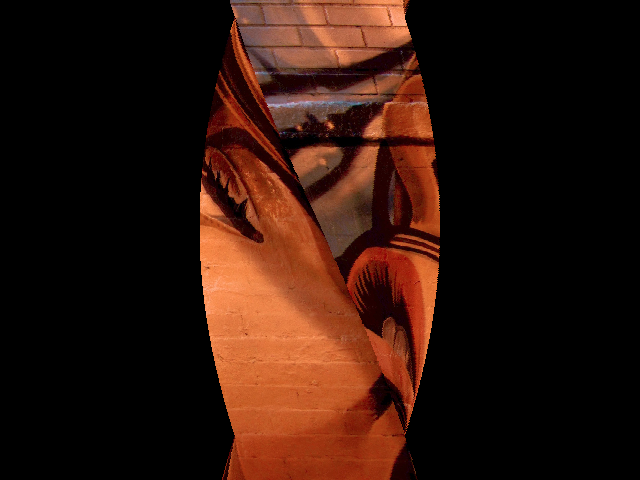

# *Texture Twister*


## **Screenshot**



## **Texture**

For this effect, you need a texture if you want to map the column with an image.  
Otherwise you can just colorize it.

## **Algorithm**

We use 4 points (x1, x2, x3, x4) where each of them have a +90 degres angle compared to the previous one.  
Then we compare each values two by two and we draw a line between then only if x(i+1) > x(i).  
As is, the effect does not show more than a rotating column.  
To spice it up, we twist the column according to the Y value, we rotate the angle and make the amplitude variable.  

We end up with the following (x0 being the center of the screen, and w the width of the column):  
``` javascript
let fv = 1.0 * y / this.display_.height;
let a = radians(90);
let x1 = x0 + (w * Math.sin(this.amplitude_ * fv + this.angle_ + a * 0));
let x2 = x0 + (w * Math.sin(this.amplitude_ * fv + this.angle_ + a * 1));
let x3 = x0 + (w * Math.sin(this.amplitude_ * fv + this.angle_ + a * 2));
let x4 = x0 + (w * Math.sin(this.amplitude_ * fv + this.angle_ + a * 3));
```

To texture the column, we slide the image according to the column width and perform a linear interpolation to retrieve the correct pixel.

``` javascript
// X texture begin/end
let xtb = this.slice_.width * 0;
let xte = xtb + this.slice_.width;

// ratio for linear interpolation
let ratio = (xte - xtb) / (x2 - x1);
```


## **License**

All the code are under the **Apache License 2.0**.  
A copy of the license is available [here](https://choosealicense.com/licenses/apache-2.0/).
